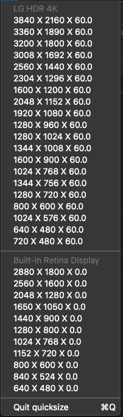

# Quicksize
Quicksize is a small utility application for Macs that allow you to quickly adjust the resolution of any connected monitors.

--- 

## Compiling the project
_I used Xcode 12 whilst developing this application (Version 12.3)_

1. Clone the project: `git clone https://github.com/ElliotJBall/quicksize`
2. Switch to the directory: `cd quicksize/`
3. Open the project in Xcode: `open quicksize.xcodeproj`
4. Compile and Launch using ⌘R

## Notes
- I am deliberately filtering out resolutions with a sub 60 (AKA 30hz) refresh rate. If you want them to also be displayed in the list fork the project and remove: `roundedRefreshRate < 59` from the `AppDelegate.swift` file on line `63`

## License 
MIT License

Copyright (c) 2020, Elliot Ball

Permission is hereby granted, free of charge, to any person obtaining a copy
of this software and associated documentation files (the "Software"), to deal
in the Software without restriction, including without limitation the rights
to use, copy, modify, merge, publish, distribute, sublicense, and/or sell
copies of the Software, and to permit persons to whom the Software is
furnished to do so, subject to the following conditions:

The above copyright notice and this permission notice shall be included in all
copies or substantial portions of the Software.

THE SOFTWARE IS PROVIDED "AS IS", WITHOUT WARRANTY OF ANY KIND, EXPRESS OR
IMPLIED, INCLUDING BUT NOT LIMITED TO THE WARRANTIES OF MERCHANTABILITY,
FITNESS FOR A PARTICULAR PURPOSE AND NONINFRINGEMENT. IN NO EVENT SHALL THE
AUTHORS OR COPYRIGHT HOLDERS BE LIABLE FOR ANY CLAIM, DAMAGES OR OTHER
LIABILITY, WHETHER IN AN ACTION OF CONTRACT, TORT OR OTHERWISE, ARISING FROM,
OUT OF OR IN CONNECTION WITH THE SOFTWARE OR THE USE OR OTHER DEALINGS IN THE
SOFTWARE.
